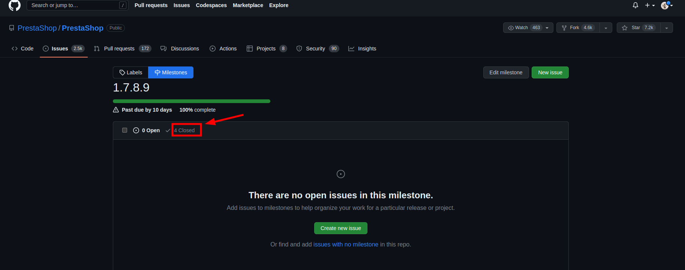

# How to create a Test Plan / Release Plan

When a new release is made by the developers, a Test Plan and a Release Plan must be created on the QA side. 

The purpose of this page is to explain how to create these different tickets before carrying out a release. 

## 1. Know the release

Before even starting to create a ticket in Jira, you need to find out about the release you're going to test. 

To do this, simply : 

1. Go to Prestashop Pull requests: 

2. Click on Milestones

1. Click on the version you require (for this example, it will be 1.7.8.9) 

4. Click on Closed (these are the merged PRs for the selected version) 

You now know all the PRs in your release. It's highly recommended that you check them all to find out what these PRs might affect. 

## 2. List the test scenarios

Now that you know what your release is about, you're going to list the different test scenarios. You'll need support to take notes. 

Again, we'll do this in a few steps: 

1. Open Jira at test case level

1. Select the various repository affected by the PRs (e.g. a change in product creation) 

3. Once you've identified the different scenarios that interest you, write them down (or mark them in your notepad). Remember not to use scenarios that have already been automated, as these will be tested via an automated test.

Once you've finished your list, you can move on to creating your Test plan and your Release plan. 

## 3. Creating your Test plan

1. Start by clicking on the "Create" button

2. Fill in the fields as follows: 

**Project** : QA Team 

**Issue Type** : Test Plan 

**Summary**: Targeted Campaign - [your_version] - Test Plan

**Description**: Targeted Campaign - [your_version] - Test Plan 

**Assigned** : Unassigned

**Affect version** : [your_version] - Test Plan

**Label** : core

**Component/s** : Core 

**Affected Tribe** : Tribe Core Open source 

and click on the "Create" button

1. To find your Test plan, click quickly on the green notification that has just appeared, otherwise : 

3.1 Click on issues 

3.2 Filter by creation date 

3.3. Your Test Plan should be the latest creation. Click on its number to open it in full screen mode. 

1. Add the tests using their names (which you've chosen beforehand) in the "Contain Text" box.

5. Select the scenarios that match your search 

6. Once these scenarios have been selected, click on "Add Selected". 

Repeat these last steps as many times as necessary to implement all the tests seen in the second chapter. 

# 4. Create your Test Execution

Now that our Test Plan has been created, we need to take care of the Test Execution, which can be created very easily. 

1. Click on "Create Test Execution" → All Test 

2. Fill in the fields as follows: 

**Project** : QA Team 

**Issue Type** : Test Execution 

**Assignee** : Unassigned

**Summary** : Targeted Campaign - [your_version] - Test Execution

**Description** : Targeted Campaign - [your_version] - Test Execution 

**Affect version** : [your_version]

**Label** : core

**Component/s** : Core 

**Affected Tribe** : Tribe Core Open source 

Keep "Redirect to Test Execution" checked and click on the "Create" button

3. To retrieve your test plan, click quickly on the green notification that has just been displayed. Otherwise, please refer to chapter 3, step 3.

If you've followed all these steps, you should now have your Test Plan and Test Execution, which you can share with your team members and developers. 

All that's left for you to do now is carry out the various tests and, at the end of the day, share with the team, made up of PMs and Developers, if we've encountered any issues during our work.

Happy Release.